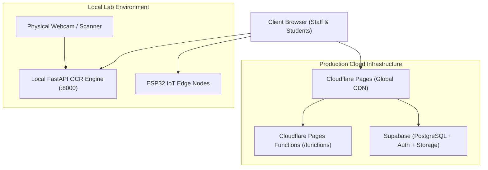

# Deployment Guide & Cloudflare Pages Configuration

This document outlines the deployment architecture for the Incubation Centre / Smart Lab Management System.

---

## Deployment Architecture

---

## Cloudflare Pages Setup

### 1. Root Functions Directory
- Cloudflare Pages requires serverless function routes to reside directly at `functions/` in the repository root.
- Handlers in `functions/api/`:
  - `functions/api/upload.js`: Multi-part image ingestion.
  - `functions/api/image/[[key]].js`: Cloudflare R2 / KV image retrieval.

### 2. Build Settings in Cloudflare Pages Dashboard
- **Framework Preset**: Vite
- **Root Directory**: `frontend` (or project root with build script)
- **Build Command**: `npm run build`
- **Build Output Directory**: `dist` (if root directory is set to `frontend`) or `frontend/dist` (if root directory is `/`)
- **Node.js Version**: `>= 18.0.0`

### 3. Environment Variables
Configure the following in Cloudflare Pages Dashboard under **Settings > Environment Variables**:
- `VITE_SUPABASE_URL`: Production Supabase project URL.
- `VITE_SUPABASE_ANON_KEY`: Production Supabase public anon key.

---

## Local Microservices (OCR & Hardware)

> [!NOTE]
> The Python OpenCV + EasyOCR backend (`backend/ocr/`) and ESP32 hardware bridges run **locally** on lab premises to provide zero-latency scanning without uploading sensitive student ID images over the internet.
> In local development, the Vite dev server proxies `/api` calls directly to `http://127.0.0.1:8000`.
