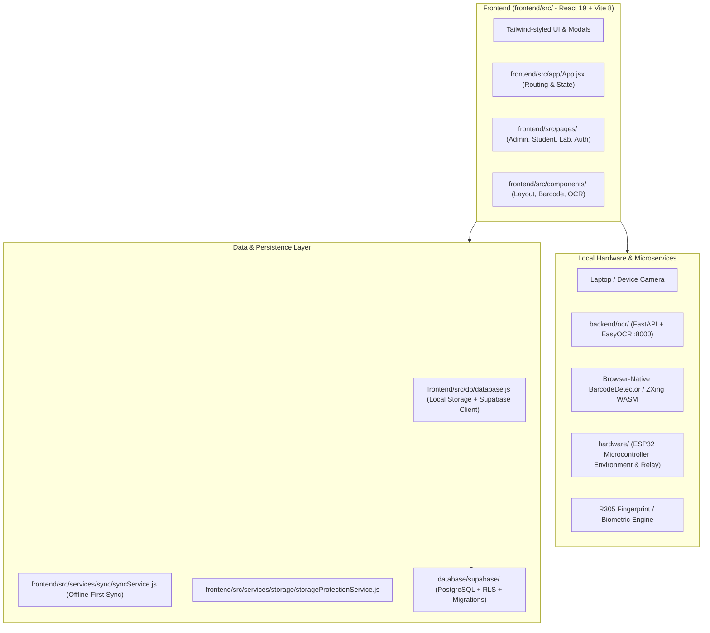

# Smart Lab Management System — Architecture

## 1. System Overview

The **Incubation Centre / Smart Lab Management System** is a full-featured campus operations platform providing inventory management, hardware checkout/return, student entry/exit logging, 4-year retention management, and biometric/vision scanning.

---

## 2. Layered Architecture

---

## 3. Directory Layout & Responsibilities

| Directory | Primary Responsibility |
|---|---|
| `frontend/src/app/` | Root application component (`App.jsx`), global state coordinators, modals. |
| `frontend/src/components/layout/` | Structural navigation and framing components (`Navbar.jsx`, `Sidebar.jsx`). |
| `frontend/src/components/barcode/` | Browser-based barcode detection modal (`BarcodeScannerModal.jsx`). |
| `frontend/src/components/ocr/` | Webcam-based real-time OCR interface (`AiOcrScanner.jsx`, `CameraModal.jsx`). |
| `frontend/src/pages/admin/` | Management views (Dashboard, Analytics, Audit Log, Students, Inventory, Transactions). |
| `frontend/src/pages/lab/` | Physical lab attendance and presence tracking (`LabEntryExit.jsx`, `StudentsInside.jsx`). |
| `frontend/src/pages/student/` | Student self-service portal (`StudentPortal.jsx`). |
| `frontend/src/pages/auth/` | Staff and administrator authentication (`Login.jsx`). |
| `frontend/src/services/biometric/` | Biometric fingerprint and facial recognition service layer. |
| `frontend/src/services/esp32/` | ESP32 environmental telemetry and relay actuator service. |
| `frontend/src/services/storage/` | Data retention auditing and storage protection policies. |
| `frontend/src/services/sync/` | Dual-mode offline storage and background Supabase synchronization. |
| `frontend/src/db/` | Database abstraction layer, schema mappings, sample records, and protected baseline backup. |
| `frontend/src/lib/` | Third-party client initializers (`supabase.js`). |
| `frontend/src/styles/` | Global CSS stylesheets, theme tokens, and typography. |
| `backend/ocr/` | Local Python microservice (OpenCV preprocessing + EasyOCR engine) on port 8000. |
| `database/supabase/` | PostgreSQL migration scripts and relational schema definitions. |
| `hardware/` | Microcontroller edge node firmware and communication bridge specs. |
| `deployment/` | Cloudflare Pages edge hosting configurations and deployment guidelines. |
| `tests/` | Automated unit tests, integration tests, and reference image fixtures. |
